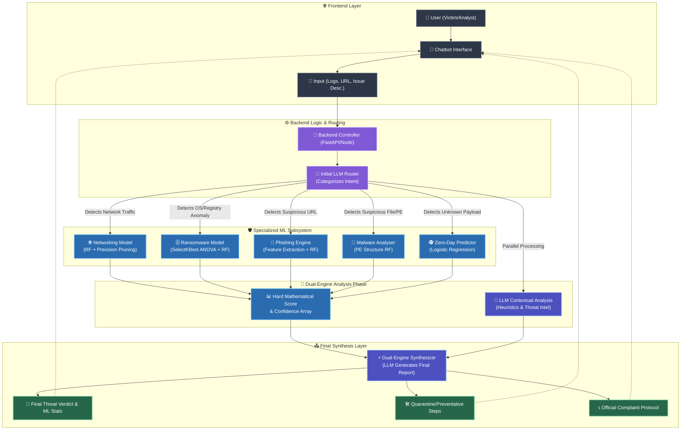

  
# 🛡️ CyberRakshak: AI-Powered Cybersecurity Assistant

**An intelligent, multi-layered threat detection and mitigation chatbot system powered by Large Language Models (LLM) and specialized Machine Learning.**

---

## 📖 Project Overview

**CyberRakshak** is an advanced cybersecurity chatbot designed to bridge the gap between complex machine learning threat detection and user-friendly incident response. 

Instead of requiring security teams to manually parse malicious files, URLs, or network logs, users simply **describe their issue or paste suspicious data into the chat**. CyberRakshak's intelligent architecture dynamically routes the issue, analyzes it synchronously using both generative AI and specialized Machine Learning arrays, and synthesizes a comprehensive incident report.

---

## 🚀 How to Run the Project (Simple Steps)

1.  **Install Prerequisites**: Install [Python](https://www.python.org/downloads/), [Node.js](https://nodejs.org/), and [PostgreSQL](https://www.postgresql.org/download/).
2.  **Setup Database**: Create a database named `cyberrakshak` in your local PostgreSQL (using pgAdmin).
3.  **Configure Environment**: 
    - Copy `Backend/env.example` to `Backend/.env`.
    - Update `DATABASE_URL` with your local PostgreSQL credentials and add your `GROQ_API_KEY`.
4.  **Launch**: Double-click **`executable_file.bat`** in the main folder.

*Note: The first run will automatically install all dependencies, so it may take a few minutes.*

---

## 📁 Project Structure & Documentation

For more detailed information on specific components, refer to their dedicated documentation:

- **[Backend Documentation](file:///c:/Users/sarve/Downloads/CyberRakshak-v.1.0/Backend/README.md)**: API architecture, database schema, and security protocols.
- **[Frontend Documentation](file:///c:/Users/sarve/Downloads/CyberRakshak-v.1.0/Frontend/README.md)**: UI components, dashboard design, and state management.
- **[Machine Learning Documentation](file:///c:/Users/sarve/Downloads/CyberRakshak-v.1.0/models/README.md)**: Model training details, datasets, and performance metrics.
- **[LLM Orchestration Layer](file:///c:/Users/sarve/Downloads/CyberRakshak-v.1.0/llm/README.md)**: Logic for AI-agent routing and incident synthesis.
- **[Technical Journey](file:///c:/Users/sarve/Downloads/CyberRakshak-v.1.0/DEVELOPMENT_JOURNEY.md)**: A stepwise procedure of how the project was built.

---

## ⚙️ How It Works (Core Architecture)

CyberRakshak operates on a high-speed, dual-engine "Router-to-Synthesizer" architecture:

1. **📥 User Input (The Prompt):** The user pastes a suspicious log, URL, malware hash, or describes a cyber incident in the chatbot.
2. **🔀 LLM Routing Engine:** The core Large Language Model intercepts the prompt and dynamically categorizes the threat vector (e.g., *Is this a phishing attempt? A network breach? Ransomware?*).
3. **⚡ Dual Execution Phase:**
   - **Machine Learning Analysis:** The LLM actively triggers the specific, pre-trained local ML model perfectly suited for the identified threat to achieve a hard mathematical probability score.
   - **LLM Contextual Analysis:** Simultaneously, the LLM analyzes the raw text/code for heuristic context, exploiting its vast cybersecurity training data.
4. **🧠 LLM Synthesis:** Both results—the hard mathematical ML Prediction and the LLM's contextual findings—are fed back into the central LLM engine.
5. **📤 Final Output Generation:** The chatbot replies with a cleanly formatted, highly actionable intelligence report.

---

## 🧠 The Machine Learning Arsenal

Behind the scenes, the LLM routes data to one of five deeply optimized, regularization-constrained Machine Learning pipelines:

- 🌐 **Network Anomaly Model:** Random Forest filtering TCP/UDP intrusion patterns.
- 🦠 **Malware Detection Model:** Tree ensembles parsing Portable Executable (PE) architecture and memory states.
- 🗄️ **Ransomware Behavioral Model:** ANOVA-optimized feature selection targeting rapid OS Registry/API corruption.
- 🎣 **Phishing Evaluator:** Extracts structural heuristics from suspicious URLs.
- 🕵️ **Zero-Day Predictor:** Logistic regression mapping generalized, undocumented payload anomalies to intercept previously unseen threats.

*(Note: See the `models/` directory for dedicated, deeply technical READMEs explaining the training, dataset mapping, and hyperparameter tuning of each pipeline).*

---

## 🎯 The Final Intelligence Report

When CyberRakshak successfully synthesizes an incident, the user receives an actionable **Threat Mitigation Report** that guarantees:

* **📊 Mathematical Confidence:** The exact output precision and accuracy score from the triggered ML Model.
* **🔎 Threat Verdict:** A clear "Malicious" or "Benign" decision.
* **🛠️ Contextual Breakdown:** *Why* the system believes it is malicious (powered by the LLM).
* **🛡️ Preventative Steps:** Immediate, tailored action items to quarantine the threat or secure the network.
* **📞 Reporting Protocol:** Direct guidance on how and where to file an official cyber complaint or incident report based on the vector.

---

  <i>"Empowering continuous defense through hybrid artificial intelligence."</i>

